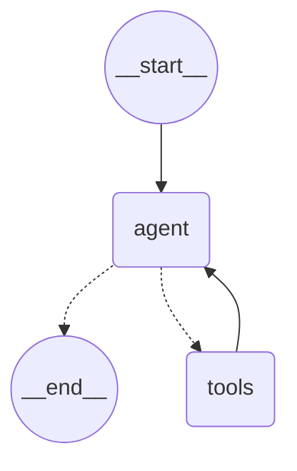

# Ariana Feast — Restaurant Ordering Platform

Ariana Feast is a restaurant ordering website with a Next.js frontend and an AI backend built on FastAPI, LangGraph, and Supabase. The site includes a chat widget that can show the menu, take an order, confirm checkout with the user before placing it, check order status, and cancel an order when possible.

This document explains both halves of the project: the frontend and the backend.

## Overview

The frontend is a normal Next.js website: a home page, a menu page with food cards, an about page, a gallery, a dashboard, and a customers page. A floating chat button sits in the corner of every page. Clicking it opens a chat panel where a customer can order using natural language instead of clicking through the menu.

The backend is a FastAPI service. Most of it is plain REST endpoints that the website calls directly, for example to list meals or look up an order. One endpoint, /chat, is different: it talks to a LangGraph agent that can call tools to search the menu, manage a cart, place an order, check an order's status, or cancel it.

Both the website and the chatbot read and write the same Supabase database, so an item added to the cart by the chatbot appears in the website's cart immediately, and vice versa.

## Frontend

The site has the following pages: Home, Menu, About, Gallery, Dashboard, Customers, and a cart view. The menu page shows each meal as a card with a photo, a title, a short description, a price, a star rating, and an Add button. This data comes from the backend's GET /menu endpoint, not from hardcoded content, so any change in the meals table shows up on the site right away.

The chat widget lives in components/chat-widget/. It is made of a launcher button, a modal that holds the conversation, a message bubble component, a loading indicator, a checkout confirmation card, and a hook that talks to the backend.

A few details worth knowing about how the widget behaves:

The loading state shows a spinning gradient ring around the assistant's avatar together with three bouncing dots inside the message bubble.

Because the backend returns a full answer rather than a token stream, the widget reveals the assistant's reply one character at a time after it arrives, to give the impression of live generation.

When the backend pauses the conversation to ask the user to confirm an order (the human-in-the-loop step), the widget does not show this as a normal text bubble. It shows a separate confirmation card with the cart summary, the total price, and two buttons: confirm and cancel.

After ten messages in one conversation, the backend stops accepting further messages until the conversation is reset. The widget disables the input and shows a "start new conversation" button in that case.

Setup: install the frontend dependencies, install lucide-react if it isn't already installed, add NEXT_PUBLIC_CHAT_API_URL to your .env.local pointing at the backend (for example http://127.0.0.1:8000), and add the ChatWidget component to your root layout.

## Backend

The backend code is organized in layers. app/db.py is the only file that talks to Supabase directly. app/config.py holds every environment variable in one place. app/routers/ holds the plain HTTP endpoints (menu, orders, chat). app/graph/ holds everything related to the LangGraph agent: its state, its tools, the prompt, and the compiled graph itself.

The database has the usual restaurant tables — users, meals, ratings, orders, order_items — plus two tables added for this project: carts and cart_items, which store the live shopping cart, and conversations, which counts how many messages each chat thread has used.

The cart lives in the database rather than in the agent's in-memory state. This is the key design decision that keeps the website and the chatbot in sync: whichever one changes the cart, both are reading and writing the same rows.

The agent has seven tools: search_menu, add_to_cart, remove_from_cart, view_cart, request_checkout, check_order_status, and cancel_order. request_checkout is the human-in-the-loop point — it pauses the graph and waits for the user's explicit yes or no before an order is actually created. check_order_status and cancel_order work together: cancelling only succeeds while the order is still pending, and once it reaches cooking or completed, the tool tells the customer to contact the restaurant directly instead.

The language model is reached through OpenRouter using the OpenAI-compatible client, so the model name and base URL point at OpenRouter rather than at OpenAI directly. Not every model on OpenRouter supports tool calling, and this project depends on tool calling, so the chosen model has to support it.

Setup: create a virtual environment, install requirements.txt, copy .env.example to .env and fill in the Supabase and OpenRouter keys, run the SQL migration in sql/001_cart_and_limits.sql against your Supabase project, then start the server with uvicorn app.main:app --reload. The interactive API docs are available at /docs once it's running.

## The LangGraph graph

This is the only part of this document rendered as a diagram, because it is the literal shape of the compiled graph rather than a description of it.

Execution always starts at the agent node. The agent either answers directly, in which case it goes to __end__, or it decides a tool is needed, in which case control passes to the tools node and then back to the agent with the tool's result. This loop continues until the agent has nothing further to call. The one exception is the request_checkout tool, which pauses this loop entirely with an interrupt and only resumes once the API layer sends the user's confirmation back in.

## Endpoints

GET /menu and GET /menu/{id} list and look up meals, used directly by the website's menu page.

GET /orders and GET /orders/{id} list a customer's orders and show one order's detail.

POST /orders/{id}/cancel cancels an order manually from the website, using the same logic as the chatbot's cancel_order tool.

POST /chat sends a message to the agent. The body needs user_id, customer_name, customer_email, message, and resume. resume should be true only when replying to a previous interrupt response.

POST /chat/reset clears a conversation's message count so a new conversation can start.

GET /health is a plain health check.

## Before production

Move the chat memory database off temporary storage, or replace SqliteSaver with a Postgres-backed checkpointer if traffic grows. Periodically clean up abandoned carts. Add IP-level rate limiting on /chat in addition to the per-user message cap. Keep the Supabase service key on the server only — never expose it to the frontend.

